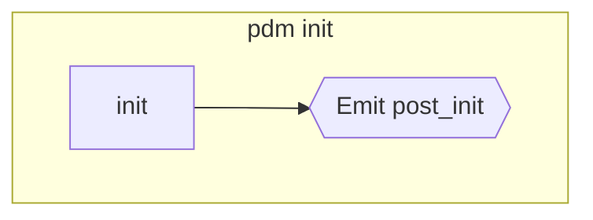
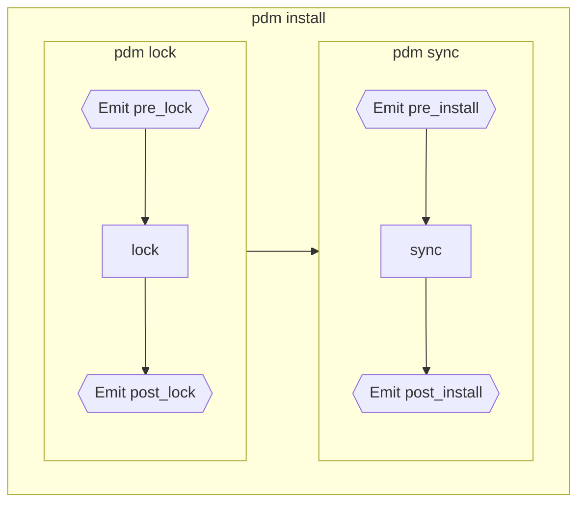
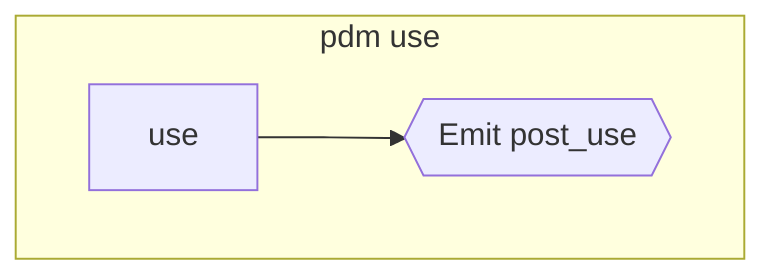
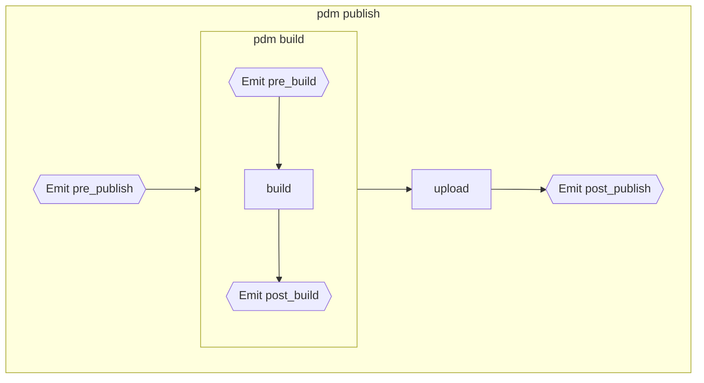
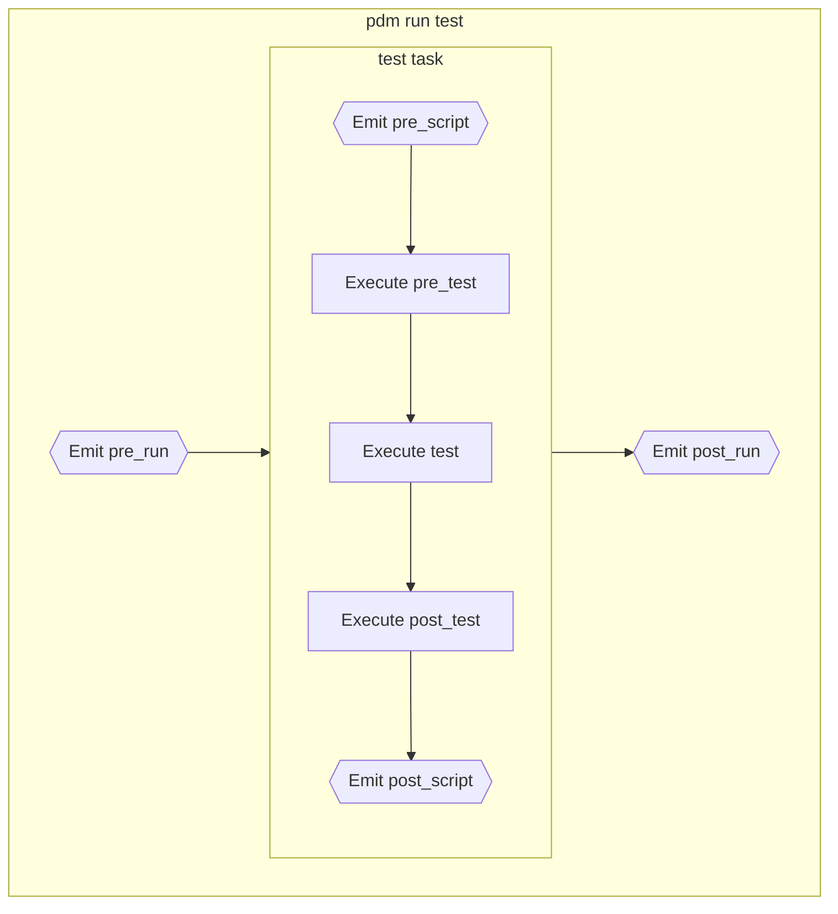
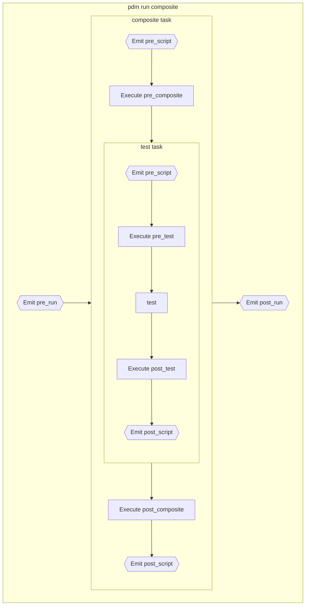
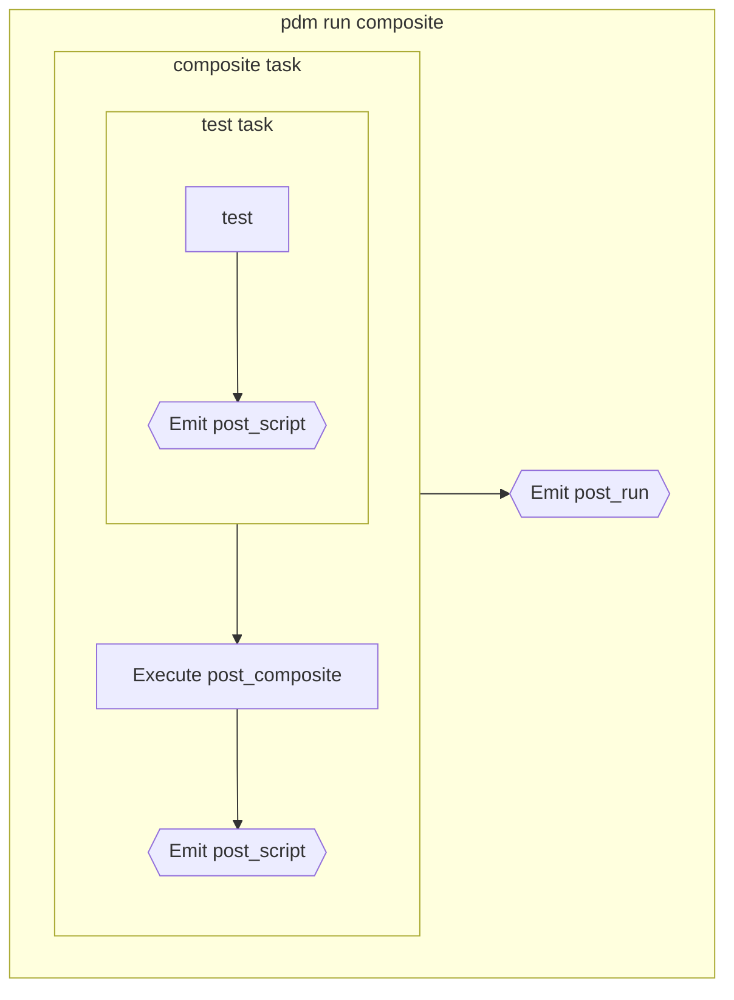

# ライフサイクルとフック

すべての Python デリバラブルと同様に、プロジェクトは Python プロジェクトのライフサイクルのさまざまなフェーズを経て進行し、PDM はこれらのフェーズの期待されるタスクを実行するためのコマンドを提供します。

また、これらのステップにフックを提供し、次のことができます。

- プラグインが同じ名前の[シグナル][pdm.signals]をリッスンする。
- 開発者が同じ名前のカスタムスクリプトを定義する。

さらに、`pre_invoke` シグナルは、任意のコマンドが呼び出される前に発行され、プラグインがプロジェクトやオプションを事前に変更できるようにします。

組み込みコマンドは現在、次の 3 つのグループに分かれています。

- [初期化フェーズ](#initialization)
- [依存関係管理](#dependencies-management)
- [公開フェーズ](#publication)

インストールフェーズと公開フェーズの間にいくつかの定期的なタスク（ハウスキーピング、リント、テストなど）を実行する必要がある場合があります。これが、PDM が[ユーザースクリプト](#user-scripts)を使用して独自のタスク/フェーズを定義できるようにする理由です。

完全な柔軟性を提供するために、PDM は必要に応じて[いくつかのフックとタスクをスキップ](#skipping)することを許可します。

## 初期化

初期化フェーズは、既存のプロジェクトを初期化するために [`pdm init`](../reference/cli.md#init) コマンドを実行して、プロジェクトのライフタイム中に一度だけ発生する必要があります（`pyproject.toml` ファイルを埋めるためのプロンプト）。

これらは次のフックをトリガーします。

- [`post_init`][pdm.signals.post_init]



## 依存関係管理

依存関係管理は、開発者が作業を行い、次のことを実行するために必要です。

- `lock`: `pyproject.toml` の要件からロックファイルを計算します。
- `sync`: ロックファイルから PEP582 パッケージを同期（追加/削除/更新）し、現在のプロジェクトを編集可能としてインストールします。
- `add`: 依存関係を追加します。
- `remove`: 依存関係を削除します。

これらのステップは、次のコマンドで直接利用できます。

- [`pdm lock`](../reference/cli.md#lock): `lock` タスクを実行します。
- [`pdm sync`](../reference/cli.md#sync): `sync` タスクを実行します。
- [`pdm install`](../reference/cli.md#install): 必要に応じて `lock` を先行して `sync` タスクを実行します。
- [`pdm add`](../reference/cli.md#add): 依存関係の要件を追加し、再ロックしてから同期します。
- [`pdm remove`](../reference/cli.md#remove): 依存関係の要件を削除し、再ロックしてから同期します。
- [`pdm update`](../reference/cli.md#update): 最新バージョンから依存関係を再ロックし、同期します。

これらは次のフックをトリガーします。

- [`pre_install`][pdm.signals.pre_install]
- [`post_install`][pdm.signals.post_install]
- [`pre_lock`][pdm.signals.pre_lock]
- [`post_lock`][pdm.signals.post_lock]



### Python バージョンの切り替え

これは依存関係管理の特別なケースです。[`pdm use`](../reference/cli.md#use) を使用して現在の Python バージョンを切り替えることができ、新しい Python インタープリターで [`post_use`][pdm.signals.post_use] シグナルを発行します。



## 公開

パッケージ/ライブラリを公開する準備が整ったら、次の公開タスクが必要になります。

- `build`: アセットをビルド/コンパイルし、Python パッケージ（sdist、wheel）にすべてをパッケージ化します。
- `upload`: パッケージをリモート PyPI インデックスにアップロード/公開します。

これらのステップは、次のコマンドで利用できます。

- [`pdm build`](../reference/cli.md#build)
- [`pdm publish`](../reference/cli.md#publish)

これらは次のフックをトリガーします。

- [`pre_publish`][pdm.signals.pre_publish]
- [`post_publish`][pdm.signals.post_publish]
- [`pre_build`][pdm.signals.pre_build]
- [`post_build`][pdm.signals.post_build]



実行は最初の失敗で停止し、フックも含まれます。

## ユーザースクリプト

[ユーザースクリプトは独自のセクションで詳しく説明されています](scripts.md)が、次のことを知っておく必要があります。

- 各ユーザースクリプトは、`pre_*` および `post_*` スクリプトを定義でき、複合スクリプトも含まれます。
- 各 `run` 実行は、[`pre_run`][pdm.signals.pre_run] および [`post_run`][pdm.signals.post_run] フックをトリガーします。
- 各スクリプト実行は、[`pre_script`][pdm.signals.pre_script] および [`post_script`][pdm.signals.post_script] フックをトリガーします。

次の `scripts` 定義を考えます。

```toml
[tool.pdm.scripts]
pre_script = ""
post_script = ""
pre_test = ""
post_test = ""
test = ""
pre_composite = ""
post_composite = ""
composite = {composite = ["test"]}
```

`pdm run test` は次のライフサイクルを持ちます。



一方、`pdm run composite` は次のようになります。



## スキップ

組み込みコマンドやカスタムユーザースクリプトのタスクとフックの実行を制御するために、`--skip` オプションを使用できます。

これは、スキップするフック/タスク名のカンマ区切りリストと、すべてのフック、すべての `pre_*` フック、およびすべての `post_*` フックをそれぞれスキップするための事前定義された `:all`、`:pre`、および `:post` ショートカットを受け入れます。スキップリストを `PDM_SKIP_HOOKS` 環境変数に提供することもできますが、`--skip` パラメータが指定されると上書きされます。

前のスクリプトブロックを考えると、`:pre,post_test composite` をスキップする `pdm run --skip` を実行すると、次のようにライフサイクルが短縮されます。


